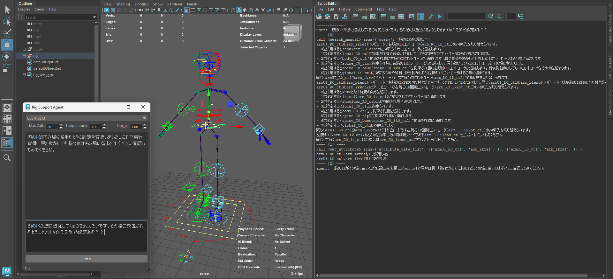

# Maya Agent
[Function calling](https://openai.com/blog/function-calling-and-other-api-updates)とRAG(Retrieval-Augmented Generation)を使用した、Maya上で動くサポートエージェントのテスト

**テスト環境**
* Windows 10
* Maya 2024 (Python 3.10.8)
* Python 3.10.9 (VSCode)
* openai 0.28.0

# 実行手順
1. [API keys - OpenAI API](https://platform.openai.com/account/api-keys)よりAPI Keyを取得し、環境変数`OPENAI_API_KEY`に設定

## ベクトルストア作成

2. Python仮想環境を作成しパッケージをインストール
```
python -m venv venv
venv\scripts\activate
pip install -U openai[datalib] tenacity
```

3. [`create_vectorstore.py`](./create_vectorstore.py)を実行してベクトルストアを作成（※[`query_test.py`](./query_test.py)はテスト検索スクリプト）

> **Note**  
> * [`create_vectorstore.py`](./create_vectorstore.py)に記載されている[`./rigdata/rig_manual_mgear_biped.txt`](./rigdata/rig_manual_mgear_biped.txt)は、[mGear 4.1.0](https://github.com/mgear-dev/mgear4/releases/tag/4.1.0)の **Biped Template, Y-up** 用に作成したマニュアルテキストです。  
> * これをベクトルストアにしたものも置いてあります。（[`./rigdata/rig_manual_mgear_biped.json`](./rigdata/rig_manual_mgear_biped.json)）  
> * mGear4.1.0でBipedリグをビルドしておくことですぐに試すことができます。  

## Agent起動（Maya2024）

4. Maya2024にパッケージをインストール
```
cd C:\Program Files\Autodesk\Maya2024\bin
mayapy -m pip install -U openai[datalib] tenacity -t C:\Users\<USERNAME>\Documents\maya\2024\scripts\site-packages
```

5. `rigagent`フォルダを`C:\Users\<USERNAME>\Documents\maya\2024\scripts`に移動するか、本リポジトリパスを`PYTHONPATH`に追加し、Mayaを起動

6. ベクトルストアのパスを渡してUI起動
```python
from pathlib import Path
vs_path = Path("D:/maya_agent/rigdata/rig_manual_mgear_biped.json")

import rigagent
rigagent.run(vs_path)
```


