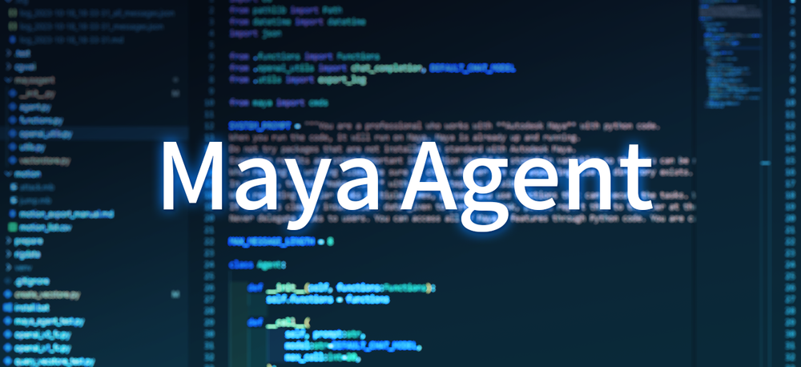

# Maya Agent
<p align="center">
<br>
自然言語の指示でAutodesk Mayaのオペレーションを行うエージェントです<br>
 <br>
<a href="https://twitter.com/akasaki1211/status/1716746810403029290">[🎥Demo movie]</a>
</p>

---

> **テスト環境**
> * Windows 10
> * Maya 2024 (Python 3.10.8)
> * openai 1.1.1

## セットアップ
1. [API keys - OpenAI API](https://platform.openai.com/account/api-keys)よりAPI Keyを取得し、環境変数`OPENAI_API_KEY`に設定

2. [./setup/install_maya2024_win.bat](./setup/install_maya2024_win.bat)を実行し、Maya2024にパッケージをインストール

3. 次のいずれかを実施
   * C:/Users/<ユーザー名>/Documents/maya/<バージョン>/scriptsに`mayaagent`フォルダをコピーする
   * 環境変数PYTHONPATHに`mayaagent`の親フォルダを追加する


## 使い方
### Agent起動🤖

以下をMayaのScriptEditorで実行します。

```python
### 通常起動 ###

import mayaagent
task = "まずはマニュアル（motion_export_manual.md）をよく読んで理解してください。マニュアルに記載された手順を遵守しStatusがFinのモーションをすべてFBX書き出ししてください。"
mayaagent.run(task)
```

```python
### 通常起動（オプション付き）###

mayaagent.run(
    task, 
    model="gpt-4-1106-preview", # モデル "gpt-4-1106-preview" または "gpt-3.5-turbo-1106"
    max_call=20,                # 最大ループ数。この数に達すると強制終了。
    auto=True                   # Falseにすると毎ターン関数実行の前に確認ダイアログが出る
)
```

```python
### マニュアルのベクトルストアを含む関数セットを渡して起動 ###

from pathlib import Path
import mayaagent
from mayaagent.tools import ToolSetWithVectorSearch
from mayaagent.vectorstore import VectorStore

# マニュアルのベクトルストア準備
manual_vs = VectorStore(
    path=Path("rig_manual_mgear_biped.json"),
    description="Find relevant information in the rig handling manual. The manual outlines the rig controller name, its function, and other auxiliary functions."
)

# ベクトルストア検索を含む関数セットを準備
tool_set = ToolSetWithVectorSearch(manual_vs=manual_vs)

# エージェント起動
task = "腕の伸びが1.5倍くらいでストップするのですが、無限に伸びるようにできますか？"
mayaagent.run(task, toolset=tool_set)
```

例えば、次のようなタスクを入力することができます。
* 『モーション出力マニュアル(filepath)をよく読んで理解してください。マニュアルの内容に従い完了済のモーションだけFBX書き出ししてください。』
* 『シーン内のモデルをカテゴリごとにgroup化してください。変な名前があったらついでに直して報告してください。』
* 『キャラクターの最新モデルシーンにmGearのガイドインポートしてビルドしてください。ガイドファイルは探してください。ビルドが終わったらExportSelectionしておいてください。mGearのスクリプトガイド(filepath)も渡しておきます。』

詳しくは[デモ](https://twitter.com/akasaki1211/status/1716746810403029290)をご確認ください。

> **Warning**  
> 1回の`mayaagent.run`メソッド呼び出しでGPT-4に複数のリクエストを行います。消費トークンに注意してください。  

### ベクトルストア📄

以下をMayaまたはVSCodeなどで実行します。

#### ベクトルストア作成
```python
from pathlib import Path
from mayaagent.vectorstore import VectorStore

# テキストからベクトルストア作成
vec_store = VectorStore.from_txt_file(
    text_path=Path("./rigdata/rig_manual_mgear_biped.txt"), 
    split_char="\n\n\n",
    description="Find relevant information in the rig handling manual. The manual outlines the rig controller name, its function, and other auxiliary functions."
)
```

#### ベクトルストア読込と検索テスト
```python
from pathlib import Path
from mayaagent.vectorstore import VectorStore

# ベクトルストア読込
vec_store = VectorStore(Path("./rigdata/rig_manual_mgear_biped.json"))

# 検索
search_result = vec_store.similarity_search("腕のIKFK切り替え", k=2)

for sr in search_result:
    print(sr[0]["content"])
    print("score:", sr[1])
    print('--'*30)
```

> **Note**  
> * [`./rigdata/rig_manual_mgear_biped.txt`](./rigdata/rig_manual_mgear_biped.txt)は、[mGear 4.1.0](https://github.com/mgear-dev/mgear4/releases/tag/4.1.0)の「**Biped Template, Y-up**」用に作成したマニュアルテキストです。  
> * これをベクトルストアにしたものも置いてあります。（[`./rigdata/rig_manual_mgear_biped.json`](./rigdata/rig_manual_mgear_biped.json)）  
> * mGear4.1.0でBipedリグをビルドしておくことですぐに試すことができます。  